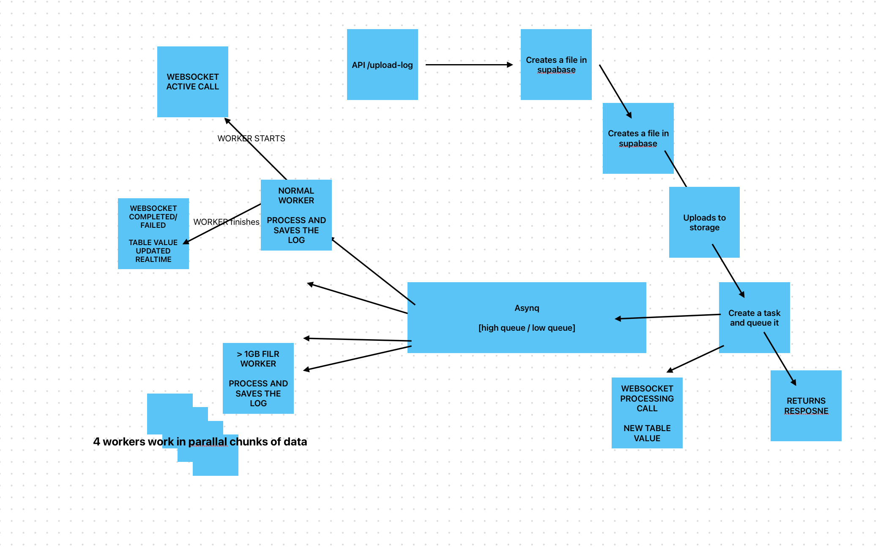

# Log Processor

Log Processor is a microservice-based log management solution using Golang, Asynq, Supabase, and Redis. It supports log processing, queue management, and real-time data aggregation.



## Features

- Asynchronous log processing using Asynq
- File storage in Supabase
- Log analysis and error detection
- REST API for log management
- Queue status monitoring

## Prerequisites

- Golang 1.21+
- Docker & Docker Compose
- Redis
- Supabase Account

## Installation

1. Clone the repository:

```bash
git clone https://github.com/your-repo/log-processor.git
cd log-processor
```

2. Set environment variables in `.env`.
3. Build and run using Docker:

```bash
sh ./scripts/start_backendService.sh
```

4. Stop services:

```bash
sh ./scripts/stop_backendService.sh
```

## API Endpoints

## Authentication

All authenticated endpoints require a JWT token in the `Authorization` header using the Bearer scheme.

### Example:

```
Authorization: Bearer <token>
```

## Endpoints

### 1. Upload Log File

- **POST /api/upload-logs**
- **Description:** Uploads a log file for processing.
- **Authentication:** Required

### 2. Get Queue Status

- **GET /api/queue-status**
- **Description:** Returns current status of the Redis queue.
- **Authentication:** Not Required

### 3. Get Aggregated Stats

- **GET /api/stats**
- **Description:** Retrieves aggregated log statistics.
- **Authentication:** Required

### 4. Get Stats By Job ID

- **GET /api/stats/:jobId**
- **Description:** Retrieves log processing statistics for a specific job.
- **Authentication:** Required

# Architecture Overview

## Overview

Log Processor is designed using a microservice pattern with the following components:

- **Main Service**: Handles API requests and manages log processing tasks.
- **Task Service**: Uses Asynq to process log files in the background.
- **Redis**: Acts as a queue management system.
- **Supabase**: Stores uploaded log files and application data.

## Component Interactions

1. User uploads a log file via API.
2. The file is stored in Supabase and a task is enqueued in Redis with asynq.
3. The Asynq worker picks the task, processes the file, and updates the database with the results.
4. Users can query the results using API endpoints.
